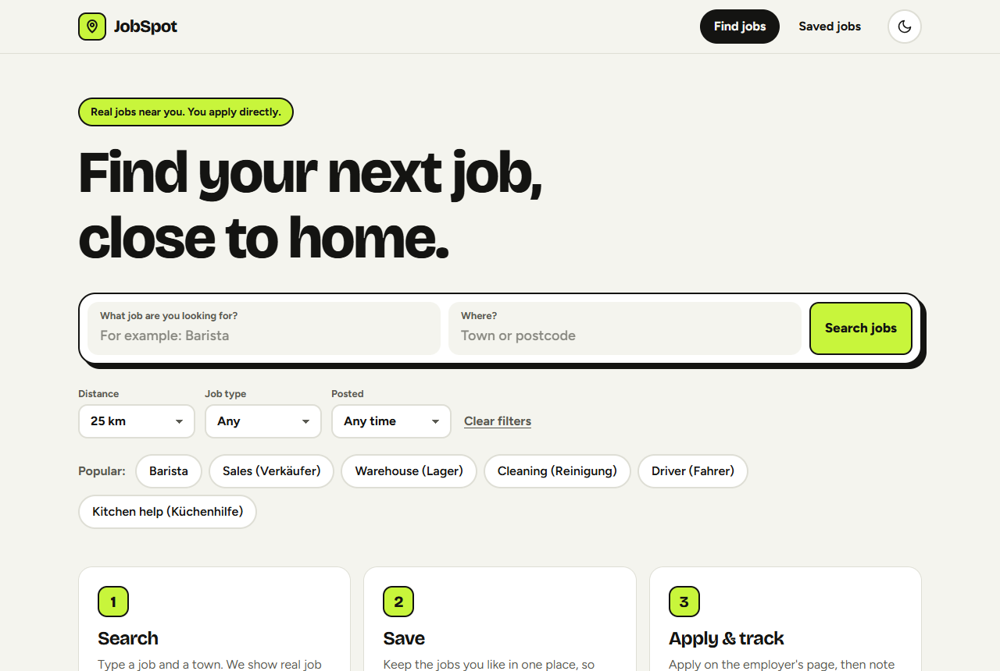
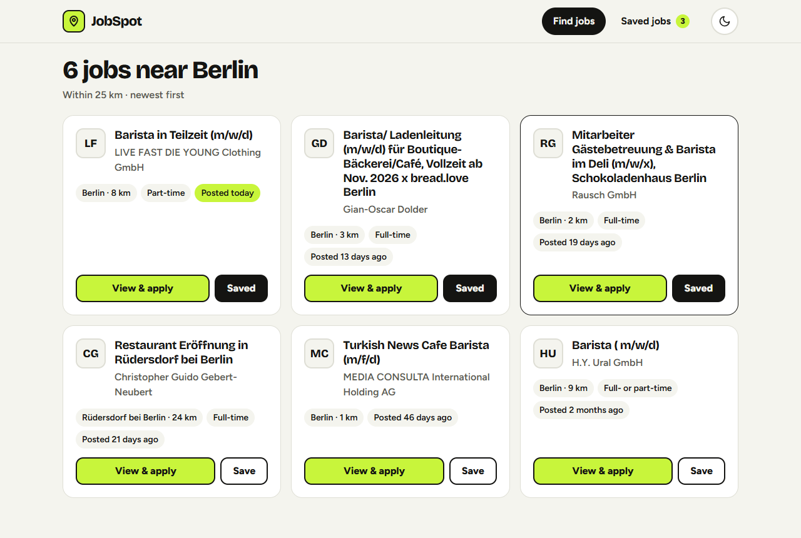
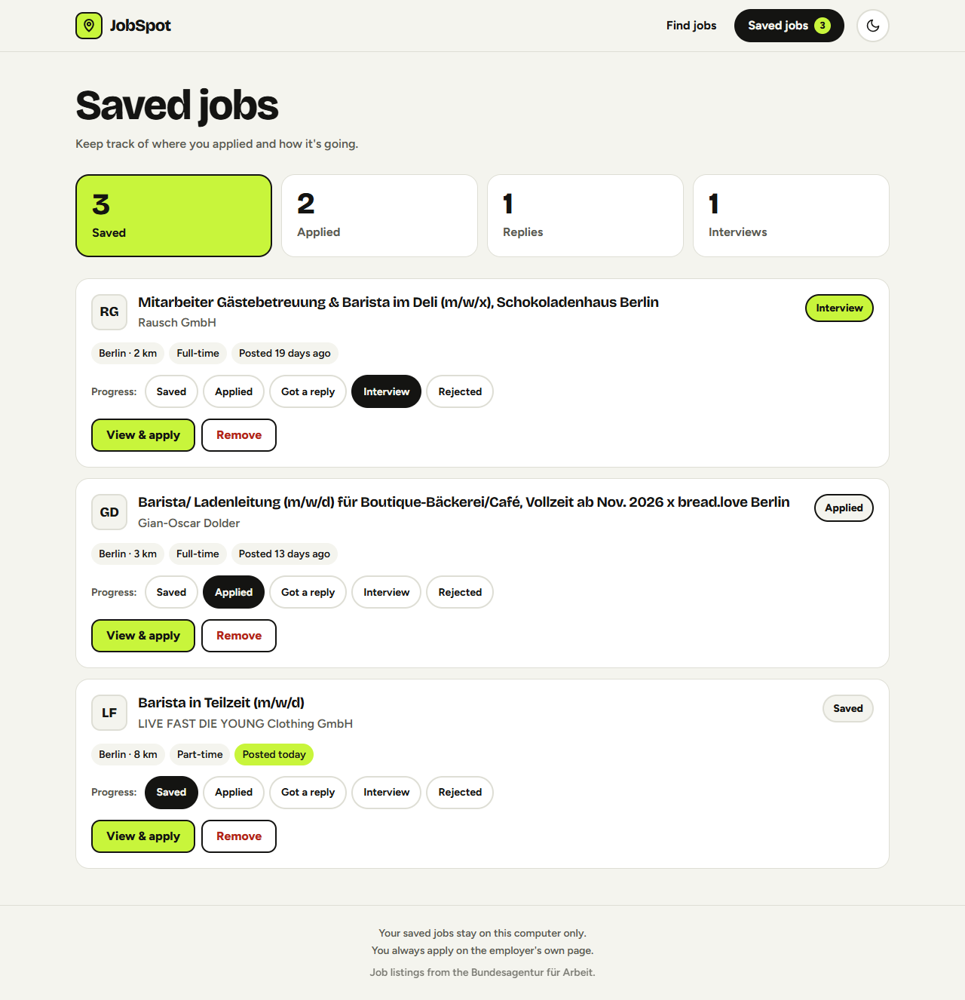
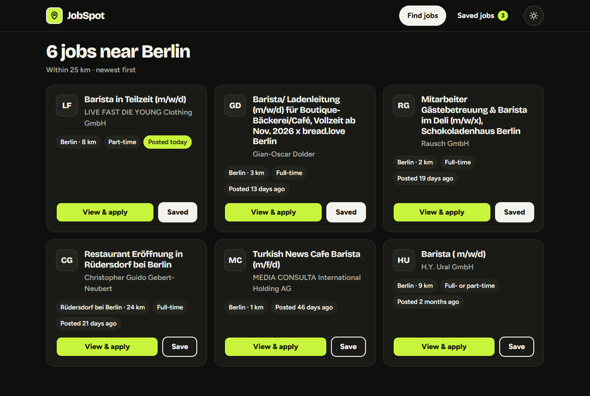
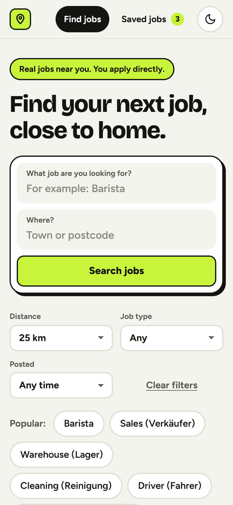

# JobSpot

**A simple, friendly job search app.** Type a job, pick a place, and see real job
listings near you. Save the ones you like and keep track of how your applications
are going. You always apply on the employer's own page — JobSpot never applies for you.



## Features

- **Real job listings** from the Bundesagentur für Arbeit (Germany's federal employment agency)
- **Filters:** distance (10 / 25 / 50 / 100 km), part-time or full-time, date posted
- **Save jobs** and track your progress: Saved → Applied → Got a reply → Interview / Rejected
- **Simple stats:** how many jobs you saved, applied to, got replies from and had interviews for
- **Private:** runs only on your computer. Your saved jobs never leave it.
- **Dark mode** (follows your computer setting, or switch with the moon button)
- Works in a **phone-sized window** too
- Friendly messages, no technical words on screen

| Search results | Saved jobs |
| --- | --- |
|  |  |

| Dark mode | Phone size |
| --- | --- |
|  |  |

## Start JobSpot (Windows)

1. **Install Python** (only once) from [python.org/downloads](https://www.python.org/downloads/).
   On the first screen of the installer, tick **"Add python.exe to PATH"**.
2. **Download JobSpot:** on this GitHub page, click the green **Code** button →
   **Download ZIP**, then unzip it (right-click → "Extract All").
3. **Double-click `start.bat`** in the JobSpot folder.

The first start takes a minute or two while JobSpot gets ready. After that it starts in
a few seconds. JobSpot opens in your browser by itself. Keep the black window open while
you use JobSpot; close it to stop JobSpot.

> Using Claude Code? Open the folder and say *"set this up and run it for me"*.

## How it works

```
 Your browser                Your computer (JobSpot server)            Internet
┌──────────────┐  /api/jobs  ┌──────────────────────────────┐  search  ┌────────────────────┐
│ index.html   │ ──────────▶ │ FastAPI route  (main.py)     │ ───────▶ │ Bundesagentur      │
│ styles.css   │             │   ↓                          │          │ Jobsuche service   │
│ app.js       │ ◀────────── │ JobSource      (sources/)    │ ◀─────── │                    │
└──────────────┘  our "Job"  │   ↓ turns their answer into  │  German  └────────────────────┘
                   shape     │     our own simple Job shape │  fields
                             │                              │
                 /api/saved  │ SQLite storage (storage.py)  │
                 ──────────▶ │   data/jobspot.db            │  ← saved jobs stay here
                             └──────────────────────────────┘
```

1. `start.bat` gets Python ready and runs `backend/launcher.py`, which starts the server
   on `127.0.0.1` (this computer only) and opens the browser.
2. The web page (`frontend/app.js`) sends your search to our own server: `GET /api/jobs`.
3. The server asks the job source. Every job source follows the same **`JobSource`
   interface**, so more sources can be added later without changing the rest of the app.
4. The Jobsuche source calls the Bundesagentur service and turns its German field names
   into our own simple `Job` shape (title, company, location, distance, job type, date, link).
5. When you save a job, the page sends it to `POST /api/saved` and it is stored in a
   SQLite database file on your computer.

## Project structure

```
jobspot/
├── start.bat              One-click start for Windows
├── backend/
│   ├── main.py            FastAPI app: API routes + serves the web page
│   ├── launcher.py        Starts the server and opens the browser
│   ├── config.py          Settings from .env (with safe defaults)
│   ├── models.py          Data shapes (Job, SearchFilters, SavedJob, Stats) with Pydantic
│   ├── storage.py         Saved jobs in SQLite
│   └── sources/
│       ├── base.py        The JobSource interface + error types
│       └── jobsuche.py    Bundesagentur Jobsuche client
├── frontend/
│   ├── index.html         The page
│   ├── styles.css         The design (light + dark mode, phone layout)
│   └── app.js             Plain JavaScript: search, save, status, stats
├── tests/                 pytest tests (with fake job-service answers, no internet needed)
├── docs/screenshots/      Pictures for this README
├── data/                  Your saved jobs database (not in git)
├── requirements.txt       Python packages for the app
└── requirements-dev.txt   + packages for running the tests
```

## API

| Method | Route | What it does |
| --- | --- | --- |
| `GET` | `/api/jobs?what=&where=&distance=25&job_type=any&posted_days=&page=1` | Search jobs |
| `GET` | `/api/saved` | List saved jobs |
| `POST` | `/api/saved` | Save a job (body: a job from the search) |
| `PUT` | `/api/saved/{id}/status` | Change status (`saved`, `applied`, `replied`, `interview`, `rejected`) |
| `DELETE` | `/api/saved/{id}` | Remove a saved job |
| `GET` | `/api/stats` | Numbers for the stat boxes |

Errors always come back as `{"message": "a friendly sentence"}`, so the page can show them
as they are. Interactive API docs: http://127.0.0.1:8000/docs while JobSpot is running.

## For developers

```powershell
python -m venv .venv
.\.venv\Scripts\python.exe -m pip install -r requirements-dev.txt

# Run the tests (no internet needed: they use saved fake answers)
.\.venv\Scripts\python.exe -m pytest

# Run the server with auto-reload while you change code
.\.venv\Scripts\python.exe -m uvicorn backend.main:app --reload --host 127.0.0.1
```

Settings can be changed in `.env` (see `.env.example`): port, database file location,
and the Jobsuche key.

## Tech stack and choices

- **Python + FastAPI** for the server: clear routes, data checking with **Pydantic**, and
  automatic API docs.
- **httpx** to call the job service, with a timeout and friendly errors when it is down.
- **SQLite** for saved jobs: one local file, no database server to install.
- **Plain HTML, CSS and JavaScript** for the page: no build step, nothing to install.
  Job text is always added with `textContent`, so a listing can never inject code into the page.
- **pytest** with `httpx.MockTransport` and temporary databases: the tests never touch the
  internet or your real saved jobs.

## Job source

Job listings come from the **Bundesagentur für Arbeit Jobsuche** service, the same service
its official job search app uses (community documentation:
[bundesAPI/jobsuche-api](https://github.com/bundesAPI/jobsuche-api)). JobSpot does not
scrape websites. It only shows the listings and links to the original job page.

## Ideas for later

- German language switch
- More job sources (for example Adzuna or Arbeitnow)
- Start file for Mac
- Desktop app with its own icon
